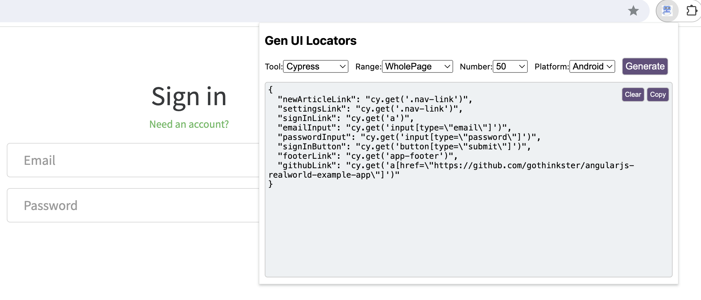

### speedtest-locator-plugin

It is a Chrome browser plugin which is used to generate ui test locators base on opened web page

### How to use the browser plugin
- Drag it to Chrome browser extension management
- Open speedtest-bot backend server,how to start speedtest bot, see [here](https://github.com/tlqiao/speedtest/tree/main/speedtest-bot)
- Open a website
- Click generate button in plugin,then it can generate all pages locators with cypress

### chrome plugin page

